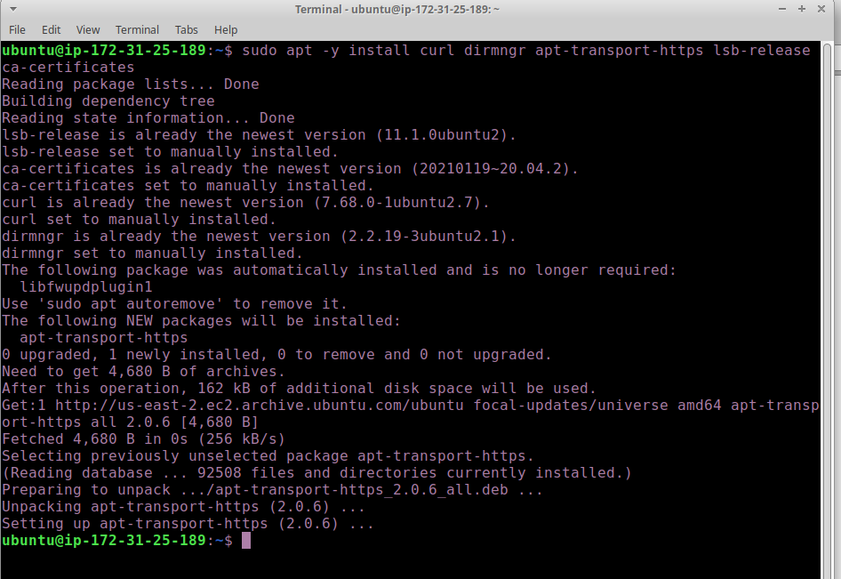
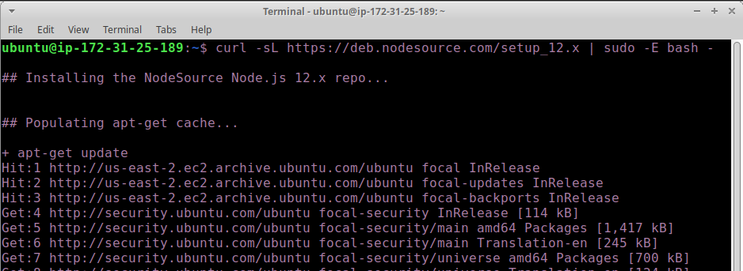
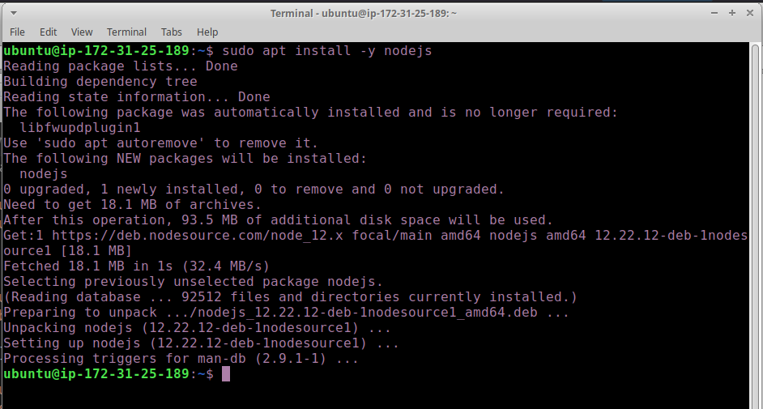
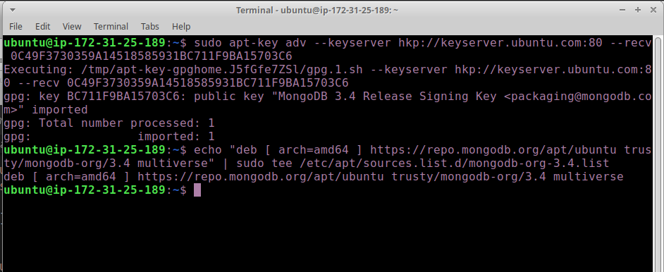
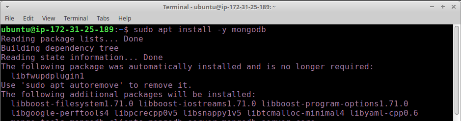
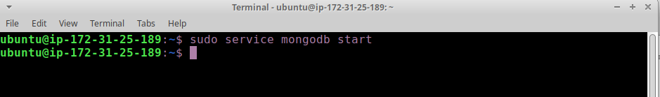
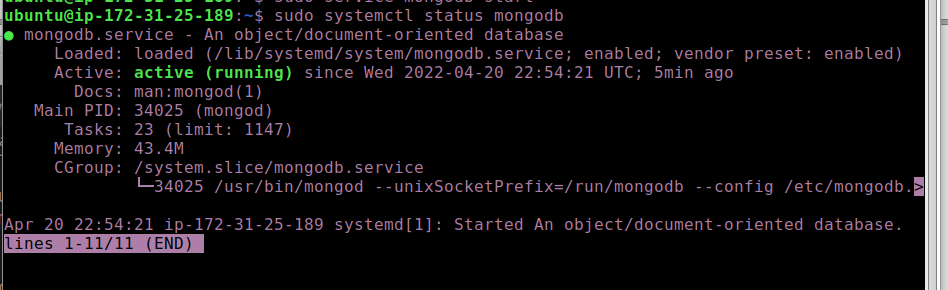
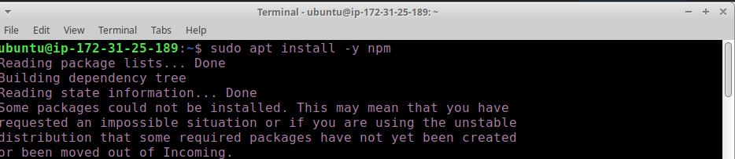
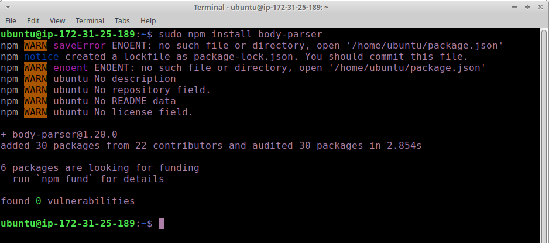
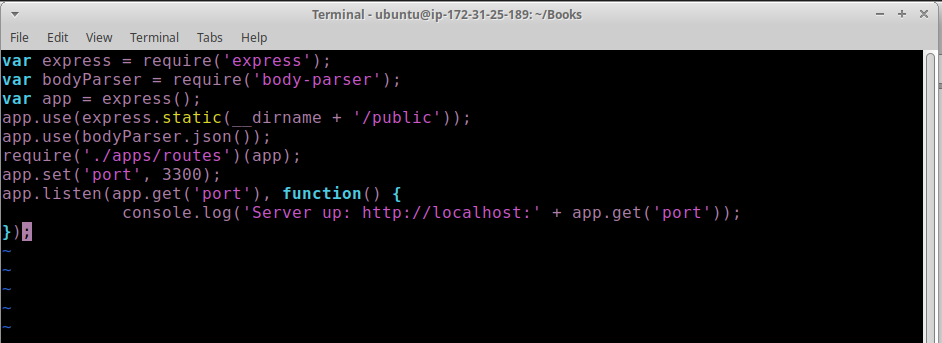

1. Update and upgrade Ubuntu run
`sudo apt update`
`sudo apt upgrade` 

2. Add certificates. run 

`sudo apt -y install curl dirmngr apt-transport-https lsb-release ca-certificates`

`curl -sL https://deb.nodesource.com/setup_12.x | sudo -E bash -`

3. Install Node.js by running
`sudo apt install -y nodejs`

## INSTALL MONGODB

MongoDB stores data in flexible, JSON-like documents. Fields in a database can vary from document to document and data structure can be changed over time. For our example application, we are adding book records to MongoDB that contain book name, isbn number, author, and number of pages.
mages/WebConsole.gif

1. run the following to get the verified key for mongodb installation

`sudo apt-key adv --keyserver hkp://keyserver.ubuntu.com:80 --recv 0C49F3730359A14518585931BC711F9BA15703C6`

`echo "deb [ arch=amd64 ] https://repo.mongodb.org/apt/ubuntu trusty/mongodb-org/3.4 multiverse" | sudo tee /etc/apt/sources.list.d/mongodb-org-3.4.list`

2. Install MongoDB 
run `sudo apt install -y mongodb`

3. Start the server
`sudo service mongodb start`

4. Verify that the service is up and running
`sudo systemctl status mongodb`

5. Install NPM node package manager
`sudo apt install -y npm`

6. Install body-parser package

We need ‘body-parser’ package to help us process JSON files passed in requests to the server.

`sudo npm install body-parser`

7. Create a folder named ‘Books’
`mkdir Books && cd Books`

8. In the Books directory, Initialize npm project
`npm init`

9. Add a file to it named server.js
`touch server.js`

10. Use vi to add the below code to server.js
`vi server.js`

var express = require('express');
var bodyParser = require('body-parser');
var app = express();
app.use(express.static(__dirname + '/public'));
app.use(bodyParser.json());
require('./apps/routes')(app);
app.set('port', 3300);
app.listen(app.get('port'), function() {
    console.log('Server up: http://localhost:' + app.get('port'));
});

